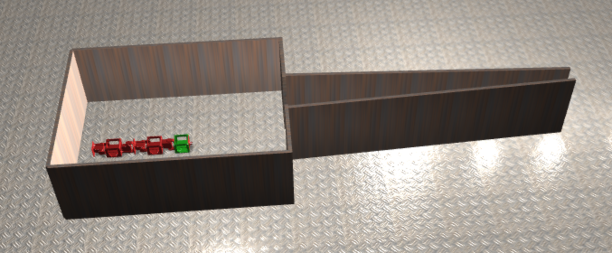
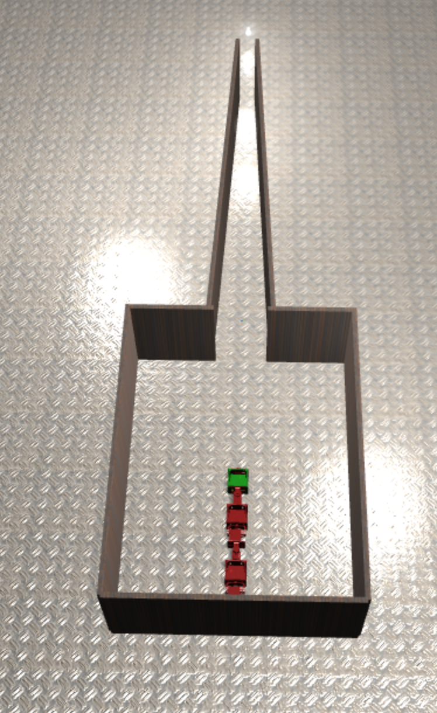
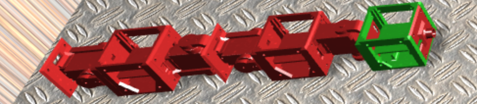

# snek

## Goal

Evolving a snake-like robot for exploration of small areas.

## Structure
### Robot configuration files

* `robot.txt` : Contains the description of the robot's architecture

You can follow [this documentation](http://robogen.org/docs/guidelines-for-writing-a-robot-text-file/) to edit the robot file.

### Environment configuration files

* `simpleArena.txt` : Contains the description of the arena
* `startPos.txt` : Configures the robot's starting position
* `singleLightSource.txt`: Configures the light source's position
* `confArena.txt` : Configures the simulation parameters

You can follow [this documentation](http://robogen.org/docs/evolution-configuration/#Simulator_settings) to edit the environment configuration.

### Evolution configuration files

* `myEvolConfFull.txt` : Configures the evolutionary parameters
* `custom_scenario.js` : Runs the evolution (this is where the fitness function lies)

You can follow [this documentation](http://robogen.org/docs/evolution-configuration/#Evolution_client_settings) to edit the environment configuration.

### Result files

* `BestAvgStd.txt` : CSV formatted as `iteration, fitness, mean_population_fitness, std_population_fitness`
* `GenerationBest-40.json` : Final configuration found by the evolution

## Running snek

1. Go to [http://robogen.com/app](http://robogen.com/app)
2. Go to the *Advanced* tab.
3. Create a new folder, enter it, and upload the files you downloaded from this repository (`git clone https://github.com/dtsbourg/snek`)
4. Click on *Start a new simulation*.
5. Configure the simulation settings as shown below :

*Note that you can chose to enable logs to get the output log files and neural network file.*

6. Click run !

You should see the arena and our robot, on a platform in space :)

## Building your own snek

You can follow [these instructions](http://robogen.org/docs/building-your-robot/#3D-print) to build your own snek ! All the parts are 3D printed (there are [pre-printed versions](https://www.shapeways.com/shops/robogen), but if you have acess to a 3D printer, the stl files are [available here](https://github.com/lis-epfl/robogen/tree/master/printing-3D)) and use standard motors and sensors.

## Contact

Did you build your own snek ? Did you make snek better ? Do you have questions about this project ? [Open an issue](https://github.com/dtsbourg/snek/issues/new) to contact us !

Do you want to help make Robogen better ? You can contact the LIS-lab on the [Robogen repo](https://github.com/lis-epfl/robogen/)

> This project was built by [Jean Gschwind](https://github.com/jGsch), [Sebastian Savidan](https://github.com/SebastianSavi) and [Dylan Bourgeois](https://github.com/dtsbourg) for the Evolutionary Robotics class given at EPFL in Switzerland (Spring 2017 session).
